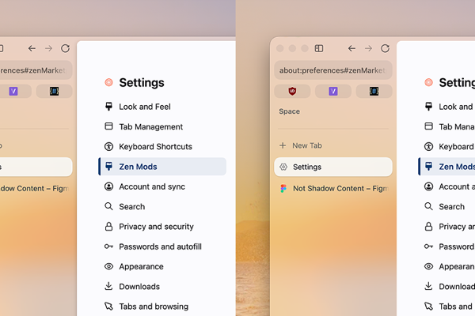

# Not Shadow Content

A Zen Browser mod that removes the drop shadow from the web content panel, leaving the rounded corners intact.



## Installation

### Via Zen Browser Mods (Recommended)

Visit the [Mods Registry](https://www.zen-browser.app/mods), search for "Not Shadow Content", and click `Install`.

This mod is not in the registry yet. The registry is currently archived and is not accepting new mods, so for now use the manual method below.

### Manual Installation

1. Copy `chrome.css` to:
   `<profile>/chrome/zen-themes/not-shadow-content/chrome.css`
2. Add the mod to `<profile>/zen-themes.json`:
   ```json
   "not-shadow-content": {
     "id": "not-shadow-content",
     "name": "Not Shadow Content",
     "description": "Removes the drop shadow from the web content panel.",
     "homepage": "https://github.com/EmanuelMendoza20/not-shadow-content",
     "style": "https://raw.githubusercontent.com/EmanuelMendoza20/not-shadow-content/main/chrome.css",
     "readme": "https://raw.githubusercontent.com/EmanuelMendoza20/not-shadow-content/main/README.md",
     "author": "EmanuelMendoza20",
     "version": "1.0.0",
     "tags": [],
     "enabled": true
   }
   ```
3. Restart Zen Browser

Your profile folder is shown in Zen under `about:support` → Profile Folder.

## How it works

Zen defines a single `--zen-big-shadow` variable at `:root`, and the content containers read it when painting their own shadow.

- **Web content**: The variable is set to `none` at the content root, so the page sits flush against the window with its rounded corners intact
- **Rest of the window**: The bookmarks sidebar, the toolbar and the download animations sit outside the content area and are left alone

## Uninstall

Delete the `not-shadow-content` folder and its entry in `zen-themes.json`, then restart Zen.

## Compatibility

Tested on Zen Browser 1.22.3b (build 126.9.22). A single CSS file: no JavaScript, no network requests, no permissions.

## License

MIT. See [LICENSE](LICENSE).
